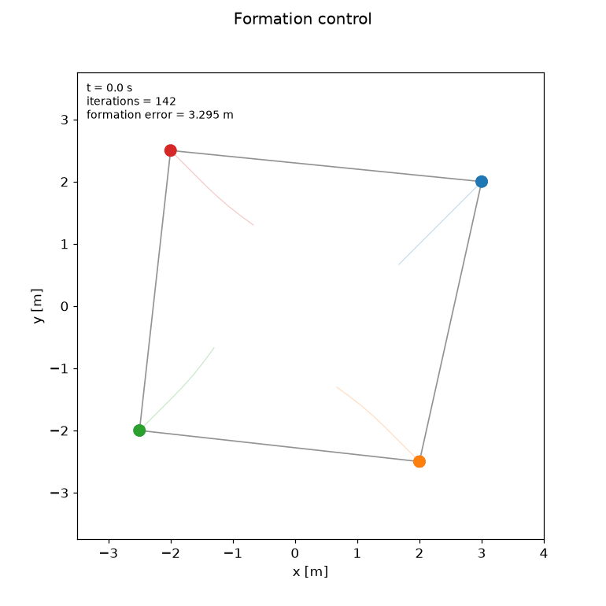
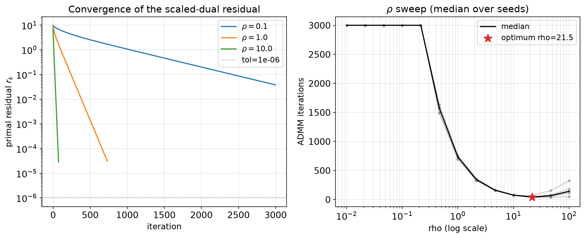
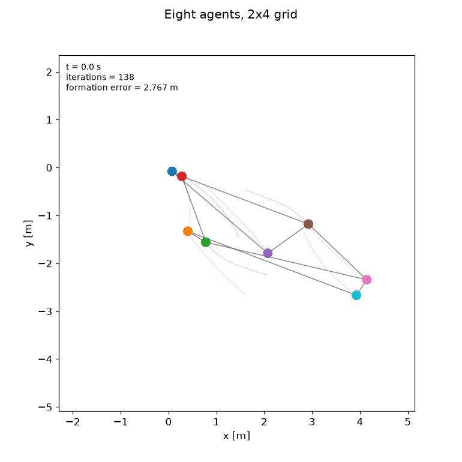
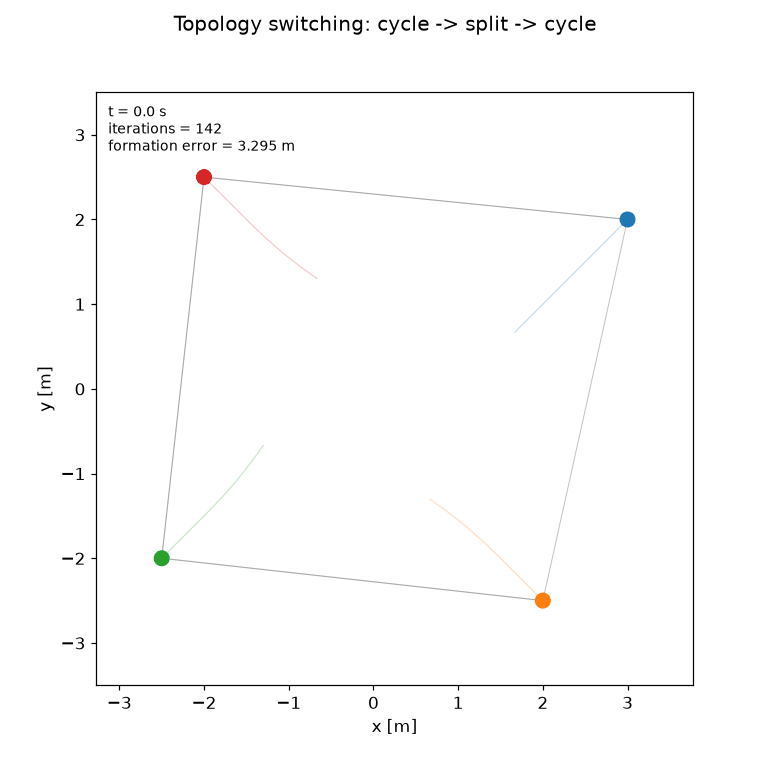
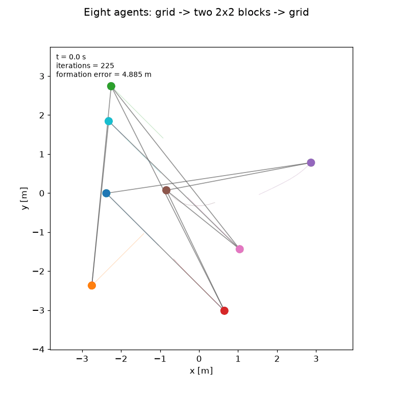

# distributed-mpc-admm

Distributed MPC via consensus ADMM for 4-to-8 double-integrator agents in 2D, with formation control and time-varying graphs.

[](https://github.com/Ali-Eiman/distributed-mpc-admm/actions/workflows/test.yml)
[](python/pyproject.toml)
[](cpp_admm/package.xml)
[](cpp_admm/CMakeLists.txt)
[](https://osqp.org)
[](https://github.com/psf/black)
[](LICENSE)



## What this is

Four to eight double integrators each run their own model predictive controller, coupled
only through formation costs on relative positions — there is no central solver anywhere in
the loop. They agree on a joint plan by running **general-form consensus ADMM** over a
communication graph: one round of neighbour-to-neighbour messages per iteration, carrying a
single `(T × 2)` trajectory block per neighbour.

The repository ships a readable Python reference and a real-time C++/ROS 2 kernel (OSQP,
one OS process per agent) that are pinned to each other by an iterate-level parity test, the
derivations behind both, and the experiments that measure where the standard convergence
guarantee stops applying.

## Results

Closed loop, 60 control steps at `dt = 0.1 s`, horizon `T = 10`, `rho = 1.0`, per-step
tolerance `2e-2`, pure formation costs (`q_position = 0`):

| Configuration | Graph | λ₂ | Settling | Final formation error | ADMM iters / step | Wall / step |
| --- | --- | ---: | ---: | ---: | ---: | ---: |
| 4 agents, square | cycle | 2.00 | 1.9 s | 0.70 cm | 5.35 | 46.6 ms |
| 4 agents, square | complete | 4.00 | 2.0 s | 0.70 cm | 5.35 | — |
| 8 agents, 2×4 grid | lattice | — | 2.4 s | 1.39 cm | 5.32 | 108.5 ms |

Open loop to `1e-4`, medians over 3 seeds, each method at its own best tuning
(ADMM `rho = 20`, dual decomposition step `2.0`) — from
[`docs/COMPARISON_VS_DUAL_DECOMP.md`](docs/COMPARISON_VS_DUAL_DECOMP.md):

| Problem | ADMM iters | ADMM wall | Dual decomp iters | Dual decomp wall |
| --- | ---: | ---: | ---: | ---: |
| 4 agents, cycle | 25 | 689 ms | 223 | 4470 ms |
| 4 agents, complete | 29 | 812 ms | 295 | 5630 ms |
| 8 agents, cycle | 25 | 1095 ms | 221 | 8048 ms |
| 8 agents, path | 23 | 948 ms | 216 | 6958 ms |

> Measured in a `python:3.13-slim` container (numpy 2.5.2, scipy 1.18.0, cvxpy 1.9.2,
> osqp 1.1.3) on an x86-64 host, Python reference path. The C++ kernel is not the subject of
> these numbers and its per-step timing has **not** been measured — see
> [Limitations](#what-this-does-not-do).



### Tuning, measured

Open-loop rendezvous on `cycle(4)` to `1e-6`, medians over 5 seeds, `adaptive_rho` off:

| | iterations |
| --- | ---: |
| `rho = 0.1` | does not converge in 3000 |
| `rho = 1.0` | 733 |
| **`rho = 21.5`** (empirical optimum) | **42** |
| adaptive `rho` | 191 |

Adaptive `rho` beats a badly chosen fixed value by 4× and loses to a well-tuned one by 4.6×,
which is the honest way round to state it. Warm starting the closed loop from the previous
step's shifted iterate halves the work: **207.6 iterations per control step cold against 97.8
warm**.

> **What the topology sweep does *not* show.** Measured at a single fixed `rho = 1.0`,
> iterations *grow* with algebraic connectivity — `complete(8)` needs 1902 against `path(8)`'s
> 719, a fitted exponent of **+0.26** where the consensus bound suggests −0.5. Two confounds
> are uncontrolled: `rho` is not retuned per topology (and the optimum above is 21.5, not 1.0),
> and the per-agent decision vector grows with degree, so a complete graph solves a much larger
> QP.
>
> `analysis/topology_robustness.ipynb` runs the same comparison at a **well-tuned** `rho = 20`
> and measures an exponent of **0.00** — iteration count independent of `λ₂` — with
> `cycle(6)`, `path(6)` and `complete(6)` converging in 16, 16 and 29 iterations. The
> connectivity dependence in the sweep above is therefore largely an artefact of running every
> topology at one badly-chosen penalty. Both numbers are reported as measured; neither
> reproduces the −0.5 the bound predicts.

## Eight agents

The 4-agent case looks like a square whatever the topology is; at eight agents on a
4-neighbour lattice the graph structure is visible in the motion.



## Switching topology



The cycle splits into two disconnected pairs at `t = 0.6 s` and merges again at `t = 3.0 s`.
While the graph is split each pair can only satisfy its own edge, so the square collapses —
formation error rises to about 0.96 m at the merge instant against 0.01 m at the end — and
the merge acts as a reset that pulls the two components back into one formation.

The split fires **during** the transient deliberately. A disconnected pair has a free
translation mode, but splitting after the formation has already settled excites nothing: both
components sit exactly where they are and the event is invisible.

At eight agents the same event is much clearer. Dropping the two middle horizontal edges of
the 2×4 lattice leaves two 4-cycles — the left and right 2×2 blocks — and because nothing
constrains one block relative to the other, they genuinely **drift apart**: their centroids
separate from 0.97 m to 2.92 m over the 2.5 s the graph is split, then close again on the
merge.



### Loss and delay cost iterations, not accuracy

Under Bernoulli packet loss the ADMM primal residual degrades as the theory predicts — the
synchronous-update assumption is gone. The *closed-loop* formation error does not: over
`loss_prob` from 0 to 0.4 the median final error stays at 0.4–1.1 cm and does not grow
monotonically. Bounded delay behaves the same way, with mean ADMM iterations rising 5.3 →
38.0 as `max_delay` goes 0 → 5 while the tracking error holds.

The receding horizon absorbs it: the controller re-solves from the true state every 100 ms,
so a sloppier inner solve is corrected at the next step, and this task has no exogenous
reference to drift away from. **The optimiser degrades; the controller does not.** Both halves
are in `notebooks/04_switching_topology.ipynb`.

This is the case the standard convergence result does not cover.
[`docs/derivations/convergence_proof.tex`](docs/derivations/convergence_proof.tex) §7 sets out
why: when the neighbourhood changes, the decision variable changes dimension, so the Lyapunov
function is defined on a space that no longer exists and monotone decrease does not merely
weaken — it becomes ill-typed.

## Method

Consensus ADMM in scaled dual form. For agent `i` with closed neighbourhood `N̄ᵢ`, at
iteration `k`:

$$(U_i, y_i) \leftarrow \arg\min\; f_i(U_i, y_i) + \frac{\rho}{2}\sum_{j \in \bar{\mathcal{N}}_i} \bigl\lVert y_i^j - z^j_k + \lambda_i^j{}_k \bigr\rVert_F^2$$

$$z^j_{k+1} \leftarrow \frac{1}{\lvert C_j \rvert} \sum_{i \in C_j} \bigl( \hat{y}_i^j + \lambda_i^j{}_k \bigr)$$

$$\lambda_i^j{}_{k+1} \leftarrow \lambda_i^j{}_k + \hat{y}_i^j - z^j_{k+1}$$

The `x`-update is a local QP with no communication. The `z`-update is computed **at agent
`j`** by averaging over its own contributors, so the only thing crossing the network is one
`(T × 2)` position-trajectory block per neighbour per iteration.

Notation is fixed once in [`docs/README_math.md`](docs/README_math.md); the derivations are
in [`docs/derivations/`](docs/derivations/).

## Repository layout

```
python/distributed_mpc_admm/   reference implementation (readable, not fast)
python/notebooks/              01-05, from ADMM intuition to convergence analysis
cpp_admm/                      OSQP + ROS 2 kernel, one process per agent
analysis/                      standalone studies: iterations, bandwidth, robustness
docs/derivations/              augmented Lagrangian, consensus ADMM, convergence proof
docs/README_math.md            notation reference -- read this before the code
media/                         generated figures and animations
```

## Quick start

### Python

```bash
cd python
pip install -e ".[dev]"
pytest -m "not slow"
```

Four agents to a square, from scattered initial conditions:

```python
import matplotlib.pyplot as plt
from distributed_mpc_admm import ADMMOptions, DistributedMPC, MPCOptions, plotting
from distributed_mpc_admm.formation_constraints import FormationSpec
from distributed_mpc_admm.per_agent_solver import AgentCostWeights, AgentLimits, DoubleIntegrator
import numpy as np

model, formation = DoubleIntegrator(dt=0.1, dim=2), FormationSpec.regular_polygon(4, radius=1.41)
x0 = np.zeros((4, model.n_states))
x0[:, :2] = [[3.0, 2.0], [-2.0, 2.5], [-2.5, -2.0], [2.0, -2.5]]

log = DistributedMPC(
    model, formation.graph, formation, AgentLimits(),
    AgentCostWeights(q_position=0.0, p_terminal=0.0),
    ADMMOptions(rho=1.0, max_iterations=300, eps_abs=2e-2, eps_rel=2e-2),
    MPCOptions(horizon=10, dt=0.1, n_steps=60, seed=0),
).run(x0)

print(log.summary())
plotting.plot_trajectories(log, formation=formation)
plt.show()
```

### C++ / ROS 2

Requires ROS 2 Lyrical Luth on Ubuntu 26.04, Eigen 3.4 and OSQP 1.x. `osqp_vendor` does not
reliably resolve through rosdep on Lyrical, so build OSQP from source at a pinned tag and
refresh the linker cache:

```bash
git clone --recursive --branch v1.0.0 --depth 1 https://github.com/osqp/osqp.git /tmp/osqp
cmake -S /tmp/osqp -B /tmp/osqp/build -DCMAKE_BUILD_TYPE=Release -DOSQP_BUILD_SHARED_LIB=ON
sudo cmake --build /tmp/osqp/build --target install -j"$(nproc)" && sudo ldconfig
```

`cppzmq-dev` (optional, for `ZeroMqTransport`) and `nlohmann-json3-dev` (required by the
parity test) come from apt. Then:

```bash
colcon build --packages-select cpp_admm --cmake-args -DCMAKE_BUILD_TYPE=Release -DBUILD_TESTING=ON
```

```bash
ros2 launch cpp_admm 4_agent_admm.launch.py
```

That starts four **separate processes**, one per agent. `-DBUILD_TESTING=ON` is not optional
if you want `colcon test` to run the C++/Python parity test rather than skip it.

## What this does not do

Stated up front because a reader who finds one of these unaided discounts everything else.

- **No collision avoidance of any kind.** Agents are coupled by formation cost only; two
  agents whose targets cross will pass straight through each other.
- **No recursive feasibility and no stability guarantee.** There is no terminal set and no
  terminal cost. Each local problem is always feasible because the constraints are boxes;
  that is feasibility, not stability. Closed-loop convergence is demonstrated numerically over
  the tested initial conditions and nothing more.
- **The ADMM convergence guarantee holds only for a fixed connected graph, synchronous
  updates and exact local solves.** Every experiment in
  [`notebooks/04_switching_topology.ipynb`](python/notebooks/04_switching_topology.ipynb)
  deliberately breaks one of those. Those results are *measurements*, not theorems.
- **The disconnected case does not converge to a common formation, and is not meant to.**
  It is reported as a failure with a mechanism.
- **Double-integrator dynamics only.** No attitude, no drag, no actuator dynamics. A double
  integrator is not a quadrotor.
- **State-estimation error is not modelled.**
- **The switching schedule in the ROS demo is published centrally**, standing in for physical
  link availability. The *control* is fully distributed; the *schedule* is not.
- **The C++ kernel's per-step timing has not been measured.** `NoHeapAllocationDuringIterate`
  proves the allocation-free claim; the real-time budget itself is unverified.

## Citing this work

See [`CITATION.cff`](CITATION.cff). The C++ kernel is the distributed solver inside the
author's `transition-viable-swarm`; the gap identified in `convergence_proof.tex` §7 — that
the guarantee assumes a fixed graph and synchronous updates — is what motivates the AHTD
object in the thesis proposal. **This repository demonstrates that gap and measures its
consequences; it does not close it.**

## References

1. S. Boyd, N. Parikh, E. Chu, B. Peleato and J. Eckstein, "Distributed Optimization and
   Statistical Learning via the Alternating Direction Method of Multipliers,"
   *Foundations and Trends in Machine Learning*, vol. 3, no. 1, pp. 1–122, 2011.
   [doi:10.1561/2200000016](https://doi.org/10.1561/2200000016)
2. B. Stellato, G. Banjac, P. Goulart, A. Bemporad and S. Boyd, "OSQP: An Operator Splitting
   Solver for Quadratic Programs," *Mathematical Programming Computation*, vol. 12, no. 4,
   pp. 637–672, 2020. [doi:10.1007/s12532-020-00179-2](https://doi.org/10.1007/s12532-020-00179-2)

Further reading, including the switching-topology consensus literature, is in
[`docs/derivations/references.bib`](docs/derivations/references.bib).

## License

BSD-3-Clause — see [LICENSE](LICENSE).
